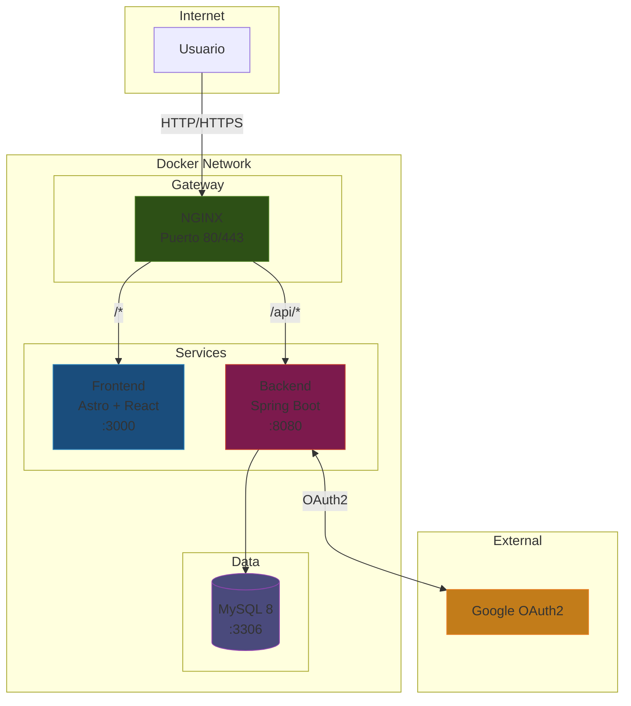
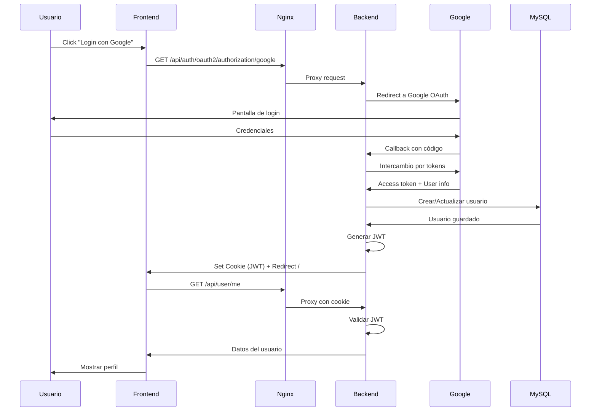
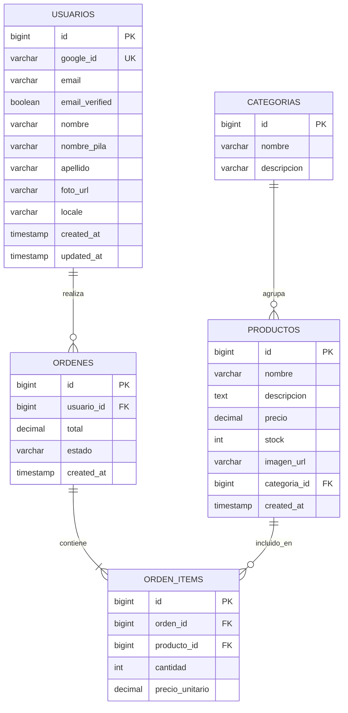
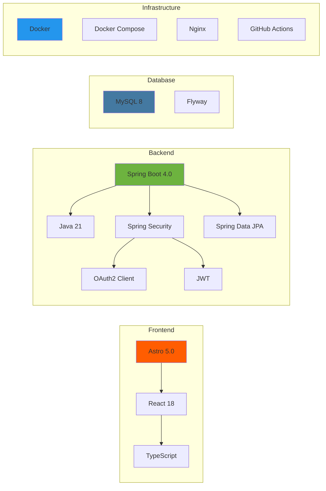
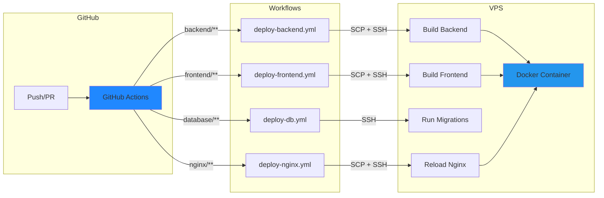

# PIME - Plataforma de E-commerce

Sistema de e-commerce moderno construido con arquitectura de microservicios, autenticación OAuth2/JWT y despliegue containerizado.

## Arquitectura del Sistema



## Flujo de Autenticación



## Modelo de Datos



## Stack Tecnológico



## Estructura del Proyecto

```
proyecto-pime/
├── backend/                    # API REST (Spring Boot)
│   ├── src/main/java/
│   │   └── com/example/demo/
│   │       ├── config/         # Configuración de seguridad
│   │       ├── controller/     # Endpoints REST
│   │       ├── entity/         # Entidades JPA
│   │       ├── repository/     # Repositorios
│   │       └── service/        # Lógica de negocio
│   ├── src/main/resources/
│   │   └── application.yaml
│   ├── build.gradle.kts
│   └── Dockerfile
│
├── frontend/                   # Web UI (Astro + React)
│   ├── src/
│   │   ├── components/         # Componentes React
│   │   └── pages/              # Páginas Astro
│   ├── package.json
│   └── Dockerfile
│
├── nginx/                      # Proxy reverso
│   └── nginx.conf
│
├── database/                   # Migraciones SQL
│   └── migrations/
│
├── .github/workflows/          # CI/CD
│   ├── deploy-backend.yml
│   ├── deploy-frontend.yml
│   ├── deploy-db.yml
│   └── deploy-nginx.yml
│
└── docker-compose.yml
```

## API Endpoints

| Método | Endpoint | Descripción | Auth |
|--------|----------|-------------|------|
| GET | `/api/auth/oauth2/authorization/google` | Iniciar login con Google | No |
| GET | `/api/auth/callback/google` | Callback de OAuth2 | No |
| GET | `/api/user/me` | Obtener usuario actual | JWT |
| POST | `/api/user/logout` | Cerrar sesión | JWT |

### Respuesta `/api/user/me`

```json
{
  "id": 1,
  "email": "usuario@gmail.com",
  "nombre": "Juan Pérez",
  "nombrePila": "Juan",
  "apellido": "Pérez",
  "fotoUrl": "https://lh3.googleusercontent.com/..."
}
```

## Instalación

### Requisitos

- Docker & Docker Compose
- Cuenta de Google Cloud (para OAuth2)

### Variables de Entorno

Crear archivo `.env` en la raíz:

```env
# Base de Datos
MYSQL_ROOT_PASSWORD=tu_password_seguro
MYSQL_DATABASE=pime

# Google OAuth2
GOOGLE_CLIENT_ID=tu_client_id.apps.googleusercontent.com
GOOGLE_CLIENT_SECRET=tu_client_secret

# JWT
JWT_SECRET=tu_clave_secreta_muy_larga_y_segura
```

### Ejecutar Localmente

```bash
# Clonar repositorio
git clone https://github.com/tu-usuario/proyecto-pime.git
cd proyecto-pime

# Iniciar servicios
docker-compose up -d

# Ver logs
docker-compose logs -f
```

### Acceso

- **Aplicación**: http://localhost
- **API**: http://localhost/api

## Deployment



El despliegue es automático mediante GitHub Actions:

1. Cada push a `main` dispara el workflow correspondiente
2. Los archivos se copian al VPS via SCP
3. Se reconstruye la imagen Docker
4. Se reinicia el contenedor

### Secretos de GitHub Requeridos

| Secret | Descripción |
|--------|-------------|
| `VPS_HOST` | IP o dominio del servidor |
| `VPS_USER` | Usuario SSH |
| `VPS_PASSWORD` | Contraseña SSH |
| `MYSQL_ROOT_PASSWORD` | Contraseña de MySQL |
| `MYSQL_DATABASE` | Nombre de la base de datos |
| `GOOGLE_CLIENT_ID` | ID de OAuth2 de Google |
| `GOOGLE_CLIENT_SECRET` | Secret de OAuth2 |

## Seguridad

- **Autenticación**: OAuth2 con Google + JWT
- **Base de datos**: Aislada en red Docker interna
- **Proxy reverso**: Nginx maneja SSL/TLS
- **Tokens**: JWT con expiración de 24 horas
- **Migraciones**: Flyway para versionado de esquema

## Tecnologías

| Capa | Tecnología | Versión |
|------|------------|---------|
| Frontend | Astro | 5.0 |
| Frontend | React | 18.3 |
| Backend | Spring Boot | 4.0 |
| Backend | Java | 21 |
| Database | MySQL | 8 |
| Proxy | Nginx | Alpine |
| Container | Docker | Latest |
| CI/CD | GitHub Actions | - |

## Licencia

MIT License
