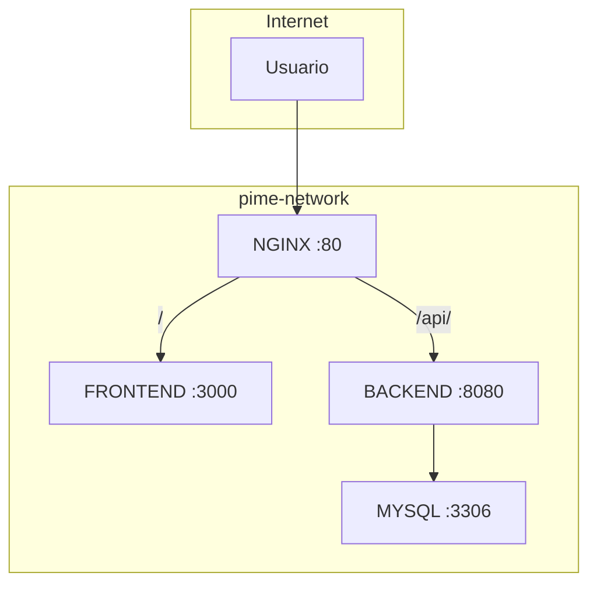
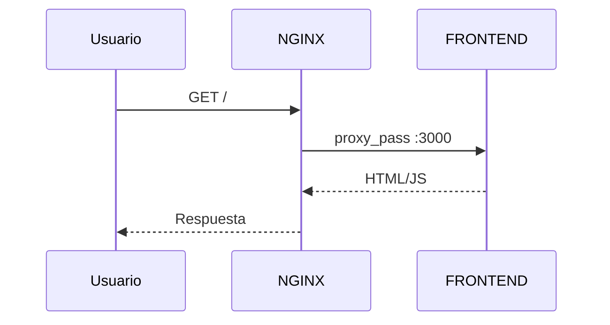
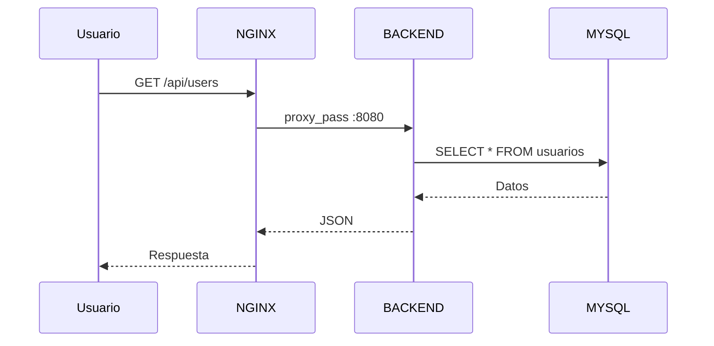
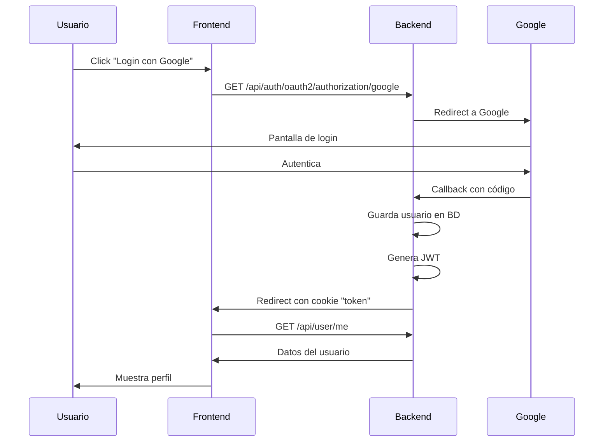

# Proyecto PIME

Aplicación de microservicios con frontend (Astro), backend (Spring Boot), base de datos (MySQL) y proxy reverso (Nginx).

---

## Guía para Desarrolladores

### Cómo trabajar

1. **Clonar el repositorio**
   ```bash
   git clone https://github.com/NicolasRobledo/proyect.git
   cd proyect
   ```

2. **Hacer cambios en el código**

3. **Subir cambios**
   ```bash
   git add .
   git commit -m "descripción del cambio"
   git push origin main
   ```

4. **Listo** - El deploy es automático

### Qué pasa cuando haces push

| Si modificas... | Se despliega automáticamente... |
|-----------------|--------------------------------|
| `frontend/**` | Frontend (Astro) |
| `backend/**` | Backend (Spring Boot) |
| `nginx/**` | Nginx (proxy) |
| `database/migrations/**` | Migraciones de BD |

> Los secretos (credenciales de Google, BD, VPS, etc.) ya están configurados en GitHub. No necesitas configurar nada local para desplegar.

### Ver estado del deploy

1. Ve a GitHub → **Actions**
2. Busca el workflow que se ejecutó
3. Verde = éxito, Rojo = error

### Agregar nueva migración de BD

1. Crear archivo en `database/migrations/`
2. Nombre: `V{numero}__descripcion.sql` (ej: `V2__add_productos.sql`)
3. Push y se ejecuta automáticamente

---

## Estructura del Proyecto

```
proyecto-pime/
├── backend/          # API Spring Boot (Java 21)
├── frontend/         # Web Astro + React
├── nginx/            # Configuración del proxy
├── database/         # Migraciones SQL (Flyway)
└── .github/workflows # Pipelines de deploy automático
```

---

## Arquitectura del Sistema

### Diagrama de Red



### Flujo de Requests

#### Frontend (/)


#### API (/api/)


### Flujo de Autenticación (Google OAuth2)



---

## Endpoints del Backend

| Método | Ruta | Descripción |
|--------|------|-------------|
| GET | `/api/auth/oauth2/authorization/google` | Inicia login con Google |
| GET | `/api/auth/callback/google` | Callback de Google |
| GET | `/api/user/me` | Obtiene usuario actual (requiere cookie) |
| POST | `/api/user/logout` | Cierra sesión |

---

## Aislamiento de Seguridad

| Sistema | Acceso Internet | Red Interna |
|---------|:---------------:|:-----------:|
| NGINX | ✅ | ✅ |
| FRONTEND | ❌ | ✅ |
| BACKEND | ❌ | ✅ |
| MYSQL | ❌ | ✅ |

> **MYSQL está completamente aislado de internet** - solo accesible desde la red interna.

---

## Desarrollo Local (Opcional)

Si quieres probar localmente antes de subir:

```bash
# Requiere Docker
docker compose up --build

# Accede a http://localhost
```

Para desarrollo local necesitas crear un archivo `.env` con las credenciales de Google OAuth. Contacta al administrador del proyecto para obtenerlas.

---

## Troubleshooting

| Problema | Solución |
|----------|----------|
| Deploy falló | Revisa logs en GitHub Actions |
| Error 502 en la web | El backend puede estar reiniciando, espera 30 segundos |
| Login no funciona | Verifica que los secretos de Google estén configurados en GitHub |
