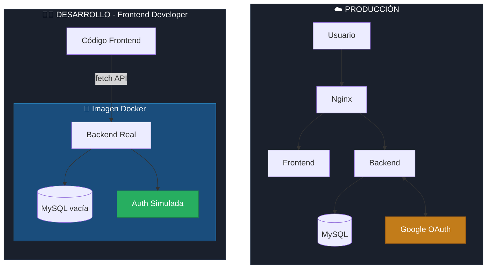
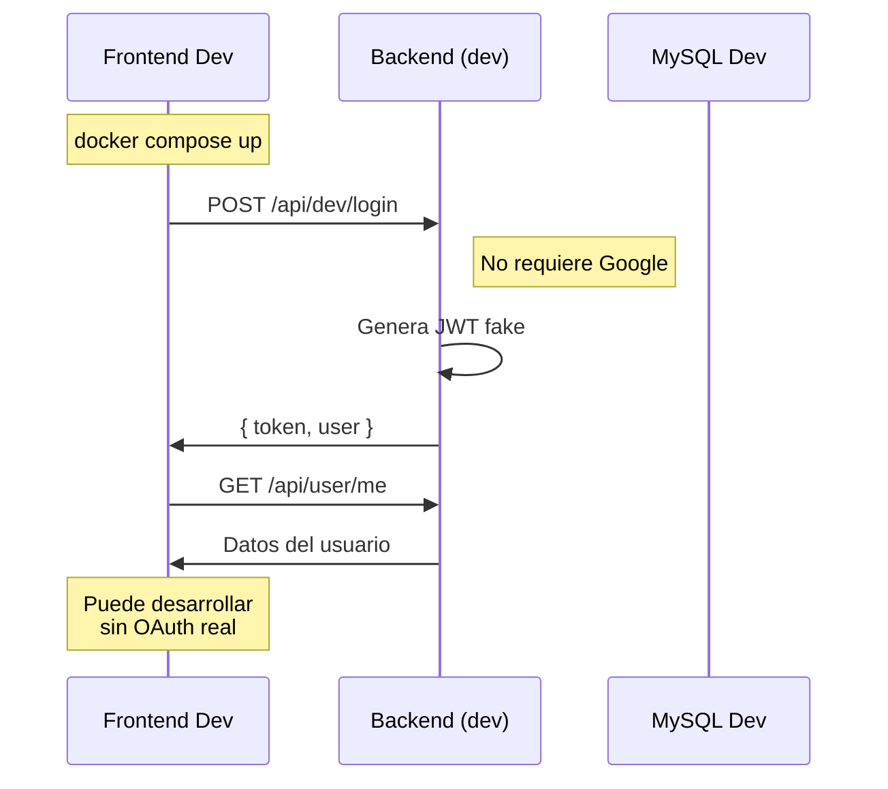
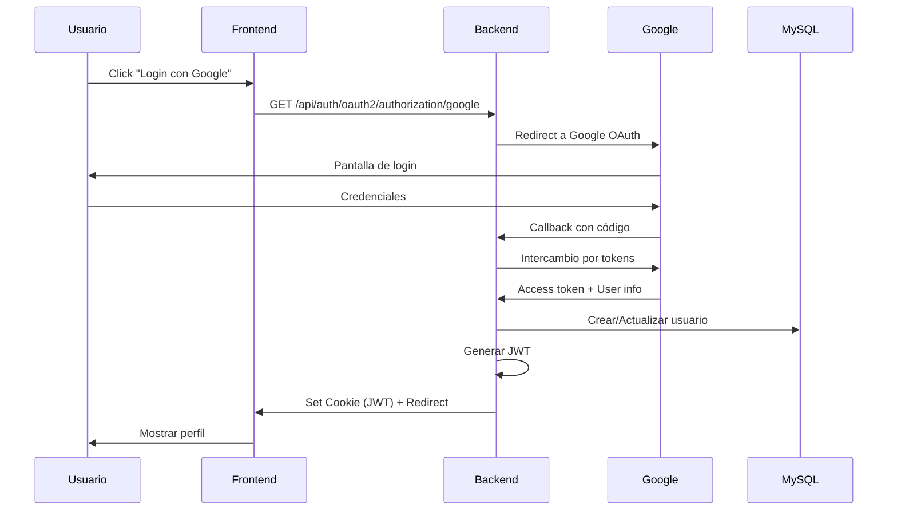

# PIME - Plataforma de E-commerce

Sistema de e-commerce moderno con arquitectura basada en perfiles de entorno, permitiendo desarrollo independiente de frontend y backend.

## Autenticación Simulada

Para desarrollo y testing, se incluye una simulación de Google OAuth 2.0 con una tabla en la base de datos.

### Endpoint de Simulación
- **POST** `/api/auth/simulate/login`: Simula login con email y nombre. Devuelve JWT y datos del usuario.
  - Body: `{"email": "user@example.com", "name": "User Name"}`
  - Respuesta: `{"token": "jwt...", "user": {...}}`

- **GET** `/api/auth/simulate/user?email=user@example.com`: Obtiene datos del usuario por email.

### Tabla de Base de Datos
- `simulated_oauth_users`: Almacena usuarios simulados con email, nombre, google_id simulado, etc.

## Arquitectura por Perfiles



## Perfiles de Entorno

| Profile | Auth | Base de Datos | Uso |
|---------|------|---------------|-----|
| `prod` | Google OAuth real | MySQL producción | Deploy en VPS |
| `dev` | Auth simulada | MySQL local vacía | Frontend developers |

### Profile DEV (para frontend developers)



### Profile PROD (producción)



## Estructura del Proyecto

```
proyecto-pime/
├── backend/                        # Spring Boot + Java 21
│   ├── src/
│   │   ├── main/java/              # Código fuente
│   │   ├── main/resources/         # Configuración
│   │   └── test/                   # Tests
│   ├── build.gradle.kts
│   └── gradlew
│
├── frontend/                       # React + Vite
│   ├── src/
│   ├── public/
│   ├── package.json
│   └── vite.config.js
│
├── docker-compose.yml              # Producción
├── docker-compose.dev.yml          # Para frontend devs
│
└── .github/workflows/
    └── publish-dev-image.yml       # Publica imagen dev a Docker Hub
```

## Stack Tecnológico

| Capa | Tecnología |
|------|------------|
| Frontend | React + Vite |
| Backend | Spring Boot 3.4 + Java 21 |
| Database | MySQL 8 |
| Auth | OAuth2 (Google) + JWT |
