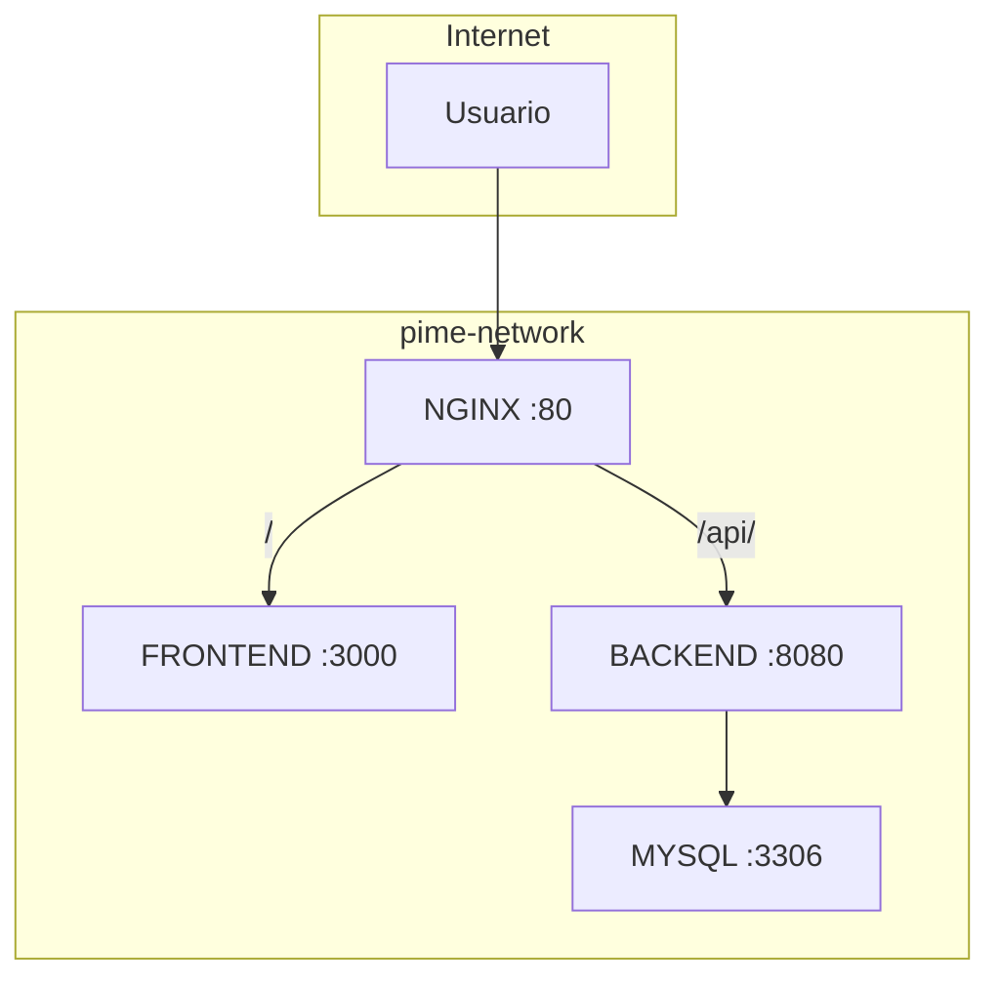
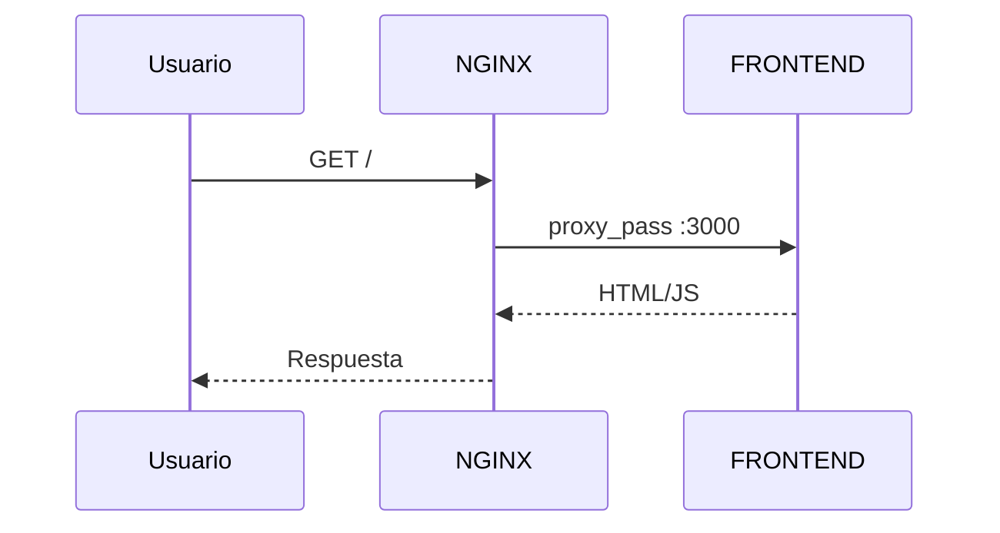
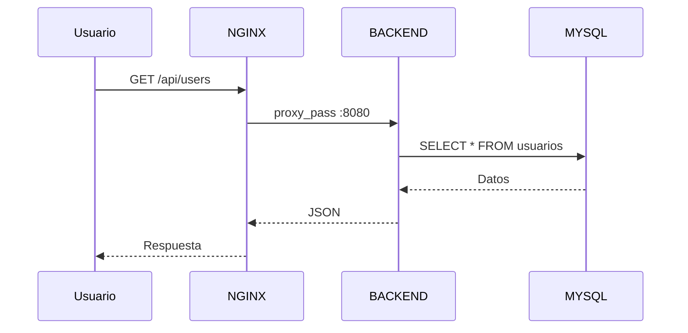
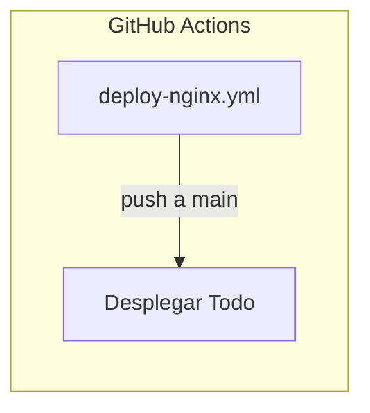

# Proyecto PIME

Aplicación de microservicios con frontend (Astro), backend (Spring Boot), base de datos (MySQL) y proxy reverso (Nginx).

## Inicio Rápido

### Prerrequisitos
- Docker y Docker Compose instalados.

### Ejecutar la aplicación
1. Clona el repositorio:
   ```
   git clone https://github.com/NicolasRobledo/proyect.git
   cd proyect
   ```

2. Crea un archivo `.env` con las variables necesarias (ej. GOOGLE_CLIENT_ID, MYSQL_ROOT_PASSWORD).

3. Construye y ejecuta los contenedores:
   ```
   docker-compose up --build
   ```

4. Accede a la app en `http://localhost` (o el dominio configurado).

### Despliegue
- Push a la rama `main` activa el workflow de GitHub Actions para despliegue automático.

# Arquitectura del Sistema

## Diagrama de Red



## Flujo de Requests

### Frontend (/)


### API (/api/)


## Contenedores por Red

| Red | Contenedores |
|-----|-------------|
| **pime-network** | nginx, frontend, backend, mysql |

## Aislamiento de Seguridad

| Sistema | Internet | pime-network |
|---------|:--------:|:------------:|
| NGINX | ✅ | ✅ |
| FRONTEND | ❌ | ✅ |
| BACKEND | ❌ | ✅ |
| MYSQL | ❌ | ✅ |

> **MYSQL está aislado de internet** - solo accesible desde la red interna.

## Workflow de Deploy


