# PIME - Plataforma de E-commerce

Sistema de e-commerce moderno con arquitectura basada en perfiles de entorno, permitiendo desarrollo independiente de frontend y backend.

## Autenticación Simulada

Para desarrollo y testing, se incluye una simulación de Google OAuth 2.0 con una tabla en la base de datos.

### Endpoint de Simulación
- **POST** `/api/auth/simulate/login`: Simula login con email y nombre. Devuelve JWT y datos del usuario.
  - Body: `{"email": "user@example.com", "name": "User Name"}`
  - Respuesta: `{"token": "jwt...", "user": {...}}`

- **GET** `/api/auth/simulate/user?email=user@example.com`: Obtiene datos del usuario por email.

### Tabla de Base de Datos
- `simulated_oauth_users`: Almacena usuarios simulados con email, nombre, google_id simulado, etc.

## Arquitectura por Perfiles

```mermaid
graph TB
    subgraph PROD[" ☁️ PRODUCCIÓN "]
        direction TB
        UP[Usuario] --> NP[Nginx]
        NP --> FP[Frontend]
        NP --> BP[Backend]
        BP --> DBP[(MySQL)]
        BP <--> GP[Google OAuth]
    end

    subgraph DEV[" 🧑‍💻 DESARROLLO - Frontend Developer "]
        direction TB
        subgraph DOCKER[" 🐳 Imagen Docker "]
            BD[Backend Real]
            DBD[(MySQL vacía)]
            SA[Auth Simulada]
            BD --> DBD
            BD --> SA
        end
        UD[Código Frontend] -->|fetch API| BD
    end

    style PROD fill:#1a202c,stroke:#2d3748,color:#fff
    style DEV fill:#1a202c,stroke:#2d3748,color:#fff
    style DOCKER fill:#1a4d7c,stroke:#2980b9,color:#fff
    style GP fill:#c27c1a,stroke:#a66315,color:#fff
    style SA fill:#27ae60,stroke:#1e8449,color:#fff
```



## Perfiles de Entorno

| Profile | Auth | Base de Datos | Uso |
|---------|------|---------------|-----|
| `prod` | Google OAuth real | MySQL producción | Deploy en VPS |
| `dev` | Auth simulada | MySQL local vacía | Frontend developers |

### Profile DEV (para frontend developers)


### Profile PROD (producción)

```mermaid
sequenceDiagram
    participant U as Usuario
    participant F as Frontend
    participant B as Backend
    participant G as Google
    participant DB as MySQL

    U->>F: Click "Login con Google"
    F->>B: GET /api/auth/oauth2/authorization/google
    B->>G: Redirect a Google OAuth
    G->>U: Pantalla de login
    U->>G: Credenciales
    G->>B: Callback con código
    B->>G: Intercambio por tokens
    G->>B: Access token + User info
    B->>DB: Crear/Actualizar usuario
    B->>B: Generar JWT
    B->>F: Set Cookie (JWT) + Redirect
    F->>U: Mostrar perfil
```



## Estructura del Proyecto

```
proyecto-pime/
├── backend/                        # Spring Boot + Java 21
│   ├── src/
│   │   ├── main/java/              # Código fuente
│   │   ├── main/resources/         # Configuración
│   │   └── test/                   # Tests
│   ├── build.gradle.kts
│   └── gradlew
│
├── frontend/                       # React + Vite
│   ├── src/
│   ├── public/
│   ├── package.json
│   └── vite.config.js
│
├── docker-compose.yml              # Producción
├── docker-compose.dev.yml          # Para frontend devs
│
└── .github/workflows/
    └── publish-dev-image.yml       # Publica imagen dev a Docker Hub
```

## Stack Tecnológico

| Capa | Tecnología |
|------|------------|
| Frontend | React + Vite |
| Backend | Spring Boot 3.4 + Java 21 |
| Database | MySQL 8 |
| Auth | OAuth2 (Google) + JWT |
