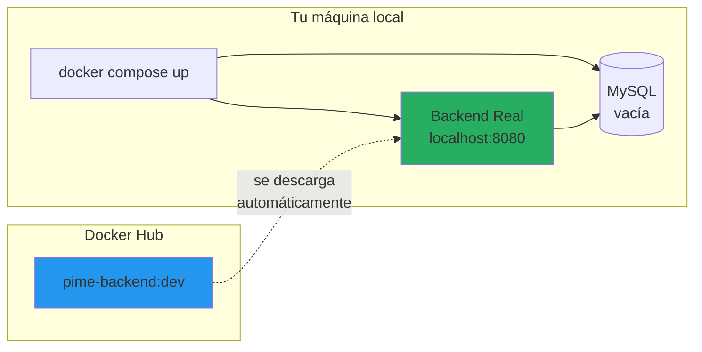

# PIME - Plataforma de E-commerce

Sistema de e-commerce moderno con arquitectura basada en perfiles de entorno, permitiendo desarrollo independiente de frontend y backend.

## Arquitectura por Perfiles


## Perfiles de Entorno

| Profile | Auth | Base de Datos | Uso |
|---------|------|---------------|-----|
| `prod` | Google OAuth real | MySQL producción | Deploy en VPS |
| `dev` | Auth simulada | MySQL local vacía | Frontend developers |

### Profile DEV (para frontend developers)


### Profile PROD (producción)


## Estructura del Proyecto

```
proyecto-pime/
├── backend/
│   ├── src/main/resources/
│   │   ├── application.yml            # Config común
│   │   ├── application-dev.yml        # Auth simulada + DB local
│   │   └── application-prod.yml       # Google OAuth + DB prod
│   ├── Dockerfile
│   └── build.gradle.kts
│
├── frontend/
│   ├── src/
│   ├── package.json
│   └── Dockerfile
│
├── database/
│   └── migrations/
│
├── nginx/
│   └── nginx.conf
│
├── docker-compose.yml              # Producción completa
├── docker-compose.dev.yml          # Para frontend devs
│
└── .github/workflows/
    ├── deploy-prod.yml             # Deploy a VPS
    └── publish-dev-image.yml       # Publica imagen dev a Docker Hub
```

## Flujo de Desarrollo


## Guía para Frontend Developers

> **El backend viene incluido.** No necesitas instalar Java, configurar bases de datos, ni entender el backend. Solo Docker.

### ¿Qué obtienes?

```
Un solo comando → Backend real + Base de datos → Todo en tu máquina
```



El backend que usas **es el mismo código de producción**, solo que configurado con auth simulada. No es un mock, es el backend real.

### Requisitos
- Docker & Docker Compose (nada más)

### Setup

```bash
# 1. Clonar repo
git clone https://github.com/NicolasRobledo/proyect.git
cd proyect

# 2. Levantar backend + base de datos
docker compose -f docker-compose.dev.yml up
```

**Eso es todo.** Ahora tienes:

| Servicio | URL | Descripción |
|----------|-----|-------------|
| Backend API | `http://localhost:8080` | Backend real con auth simulada |
| MySQL | `localhost:3306` | Base de datos vacía |

### Login simulado (sin Google)

```bash
# Obtener token de desarrollo
curl -X POST http://localhost:8080/api/dev/login \
  -H "Content-Type: application/json" \
  -d '{"email": "test@example.com", "nombre": "Usuario Test"}'
```

Respuesta:
```json
{
  "token": "eyJhbGciOiJIUzI1NiIs...",
  "user": {
    "id": 1,
    "email": "test@example.com",
    "nombre": "Usuario Test"
  }
}
```

### API Endpoints

| Método | Endpoint | Descripción | Disponible en |
|--------|----------|-------------|---------------|
| POST | `/api/dev/login` | Login simulado | Solo DEV |
| GET | `/api/auth/oauth2/authorization/google` | Login con Google | Solo PROD |
| GET | `/api/user/me` | Usuario actual | DEV + PROD |
| POST | `/api/user/logout` | Cerrar sesión | DEV + PROD |

## Guía para Backend Developers

### Requisitos
- Java 21
- Docker (solo para MySQL)

### Setup

```bash
# Levantar solo la base de datos
docker compose -f docker-compose.dev.yml up db

# Correr backend con hot reload
cd backend
./gradlew bootRun --args='--spring.profiles.active=dev'
```

### Configuración de perfiles

**application-dev.yml**
```yaml
spring:
  datasource:
    url: jdbc:mysql://localhost:3306/pime_dev
  security:
    # Auth simulada habilitada

app:
  auth:
    dev-mode: true  # Habilita /api/dev/login
```

**application-prod.yml**
```yaml
spring:
  datasource:
    url: jdbc:mysql://${DB_HOST}:3306/${DB_NAME}
  security:
    oauth2:
      client:
        registration:
          google:
            client-id: ${GOOGLE_CLIENT_ID}
            client-secret: ${GOOGLE_CLIENT_SECRET}

app:
  auth:
    dev-mode: false  # Deshabilita /api/dev/login
```

## CI/CD Pipeline


### Workflows

| Workflow | Trigger | Acción |
|----------|---------|--------|
| `publish-dev-image.yml` | Push a `main` en `backend/` | Construye y publica `pime-backend:dev` a Docker Hub |
| `deploy-prod.yml` | Push a `main` | Deploy completo a VPS |

### Secretos de GitHub Requeridos

| Secret | Uso |
|--------|-----|
| `DOCKERHUB_USERNAME` | Publicar imagen dev |
| `DOCKERHUB_TOKEN` | Publicar imagen dev |
| `VPS_HOST` | Deploy producción |
| `VPS_USER` | Deploy producción |
| `VPS_PASSWORD` | Deploy producción |
| `GOOGLE_CLIENT_ID` | OAuth producción |
| `GOOGLE_CLIENT_SECRET` | OAuth producción |

## Modelo de Datos


## Stack Tecnológico

| Capa | Tecnología | Versión |
|------|------------|---------|
| Frontend | Astro | 5.0 |
| Frontend | React | 18.3 |
| Backend | Spring Boot | 4.0 |
| Backend | Java | 21 |
| Database | MySQL | 8 |
| Proxy | Nginx | Alpine |
| Container | Docker | Latest |
| Registry | Docker Hub | - |
| CI/CD | GitHub Actions | - |

## Archivos Docker Compose

### docker-compose.dev.yml (Frontend developers)

```yaml
services:
  backend:
    image: tuusuario/pime-backend:dev
    ports:
      - "8080:8080"
    environment:
      - SPRING_PROFILES_ACTIVE=dev
    depends_on:
      - db

  db:
    image: mysql:8
    environment:
      - MYSQL_ROOT_PASSWORD=dev
      - MYSQL_DATABASE=pime_dev
    ports:
      - "3306:3306"
```

### docker-compose.yml (Producción)

```yaml
services:
  nginx:
    image: nginx:alpine
    ports:
      - "80:80"
      - "443:443"
    depends_on:
      - frontend
      - backend

  frontend:
    build: ./frontend

  backend:
    build: ./backend
    environment:
      - SPRING_PROFILES_ACTIVE=prod
      - GOOGLE_CLIENT_ID=${GOOGLE_CLIENT_ID}
      - GOOGLE_CLIENT_SECRET=${GOOGLE_CLIENT_SECRET}
    depends_on:
      - db

  db:
    image: mysql:8
    volumes:
      - mysql_data:/var/lib/mysql

volumes:
  mysql_data:
```

## Licencia

MIT License
