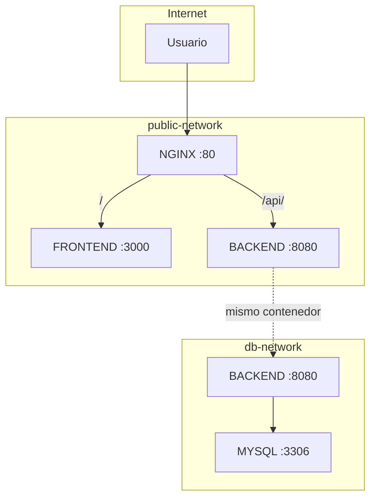
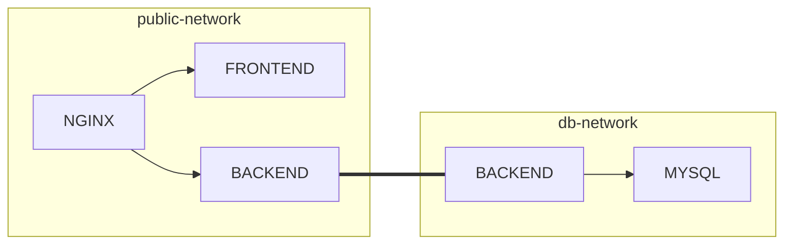
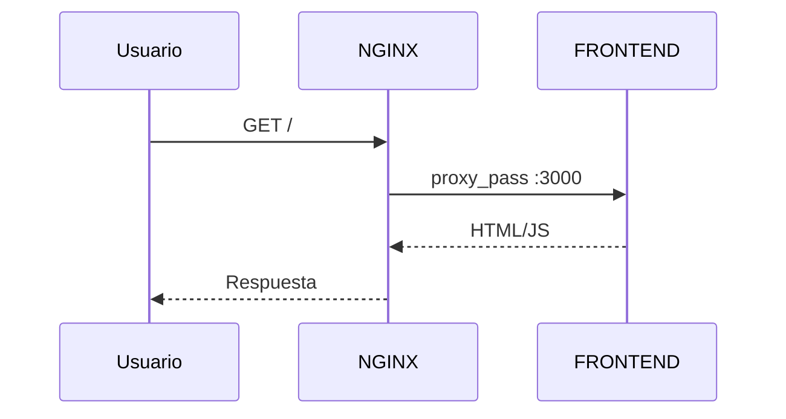
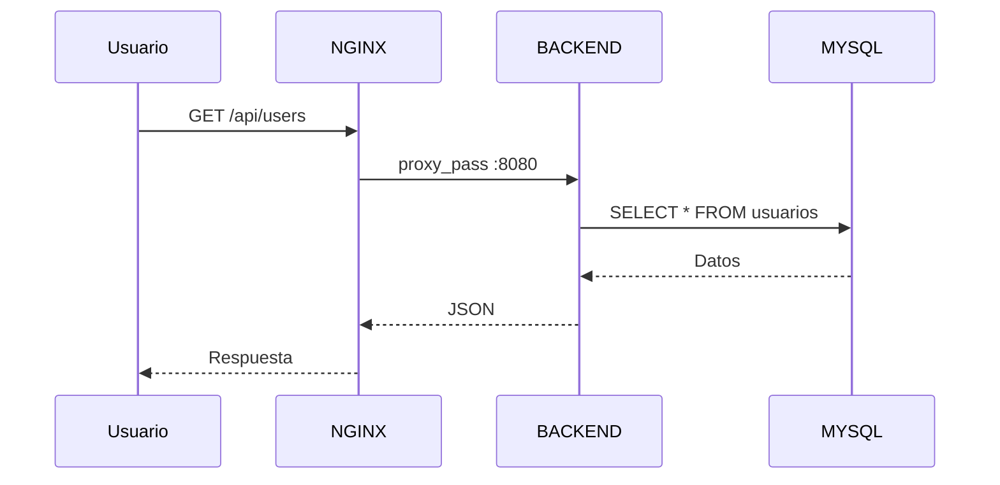
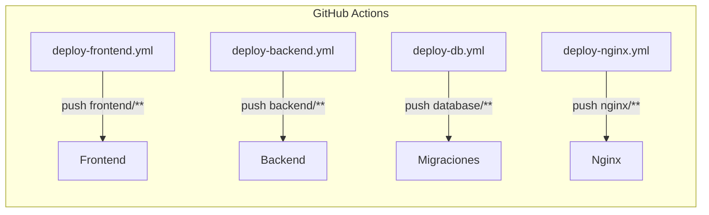

# Arquitectura del Sistema

## Diagrama de Redes

## Intersección de Redes (Venn)

## Flujo de Requests

### Frontend (/)

### API (/api/)

## Contenedores por Red

| Red | Contenedores |
|-----|-------------|
| **public-network** | nginx, frontend, backend |
| **db-network** | backend, mysql |

## Aislamiento de Seguridad

| Sistema | Internet | public-network | db-network |
|---------|:--------:|:--------------:|:----------:|
| NGINX | ✅ | - | ❌ |
| FRONTEND | ❌ | ✅ | ❌ |
| BACKEND | ❌ | ✅ | ✅ |
| MYSQL | ❌ | ❌ | ✅ |

> **MYSQL está completamente aislado** - solo el BACKEND puede acceder a él.

## Workflows de Deploy

